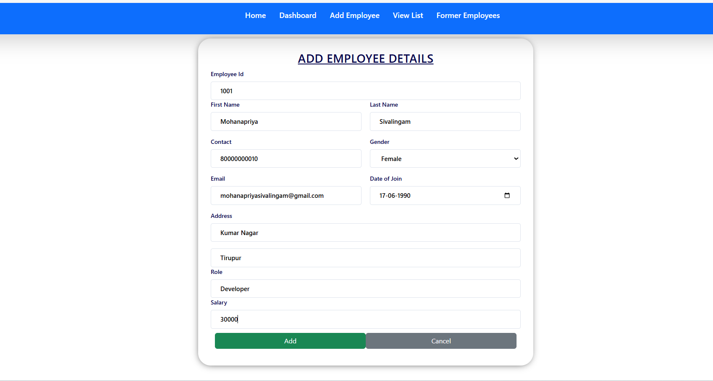
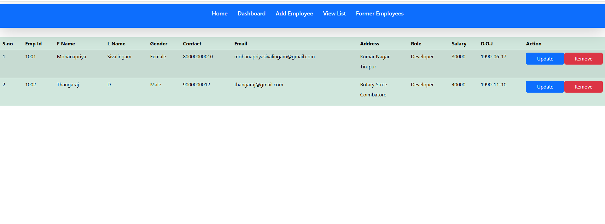
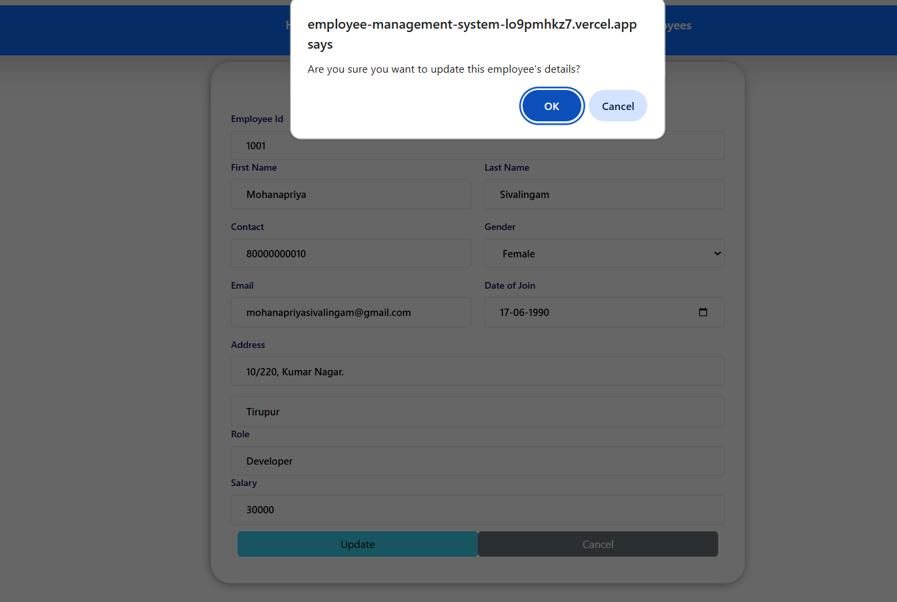
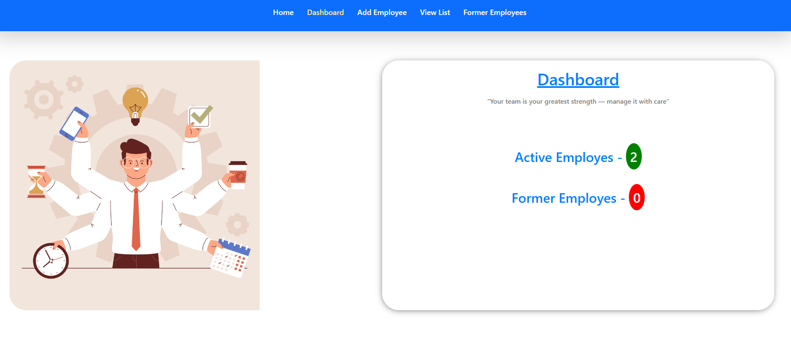
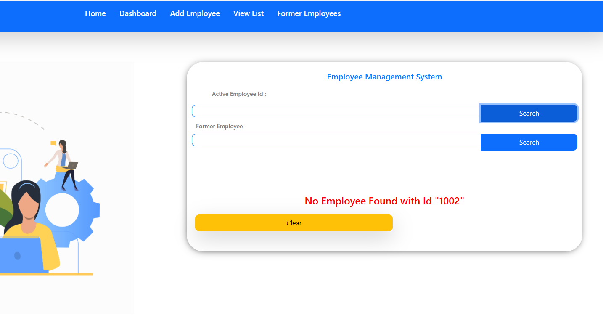
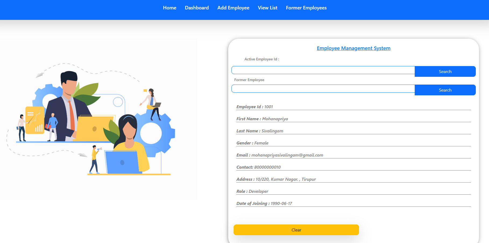
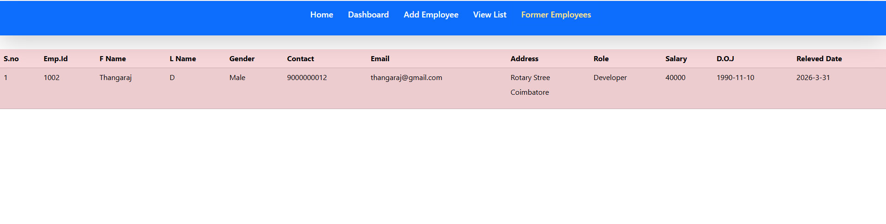

# React + Vite

This template provides a minimal setup to get React working in Vite with HMR and some ESLint rules.

Currently, two official plugins are available:

- [@vitejs/plugin-react](https://github.com/vitejs/vite-plugin-react/blob/main/packages/plugin-react) uses [Babel](https://babeljs.io/) (or [oxc](https://oxc.rs) when used in [rolldown-vite](https://vite.dev/guide/rolldown)) for Fast Refresh
- [@vitejs/plugin-react-swc](https://github.com/vitejs/vite-plugin-react/blob/main/packages/plugin-react-swc) uses [SWC](https://swc.rs/) for Fast Refresh

## React Compiler

The React Compiler is not enabled on this template because of its impact on dev & build performances. To add it, see [this documentation](https://react.dev/learn/react-compiler/installation).

## Expanding the ESLint configuration

If you are developing a production application, we recommend using TypeScript with type-aware lint rules enabled. Check out the [TS template](https://github.com/vitejs/vite/tree/main/packages/create-vite/template-react-ts) for information on how to integrate TypeScript and [`typescript-eslint`](https://typescript-eslint.io) in your project.

# 👩‍💼 Employee Management System

A modern Employee Management System built using React and Redux Toolkit.

---

## 🚀 Features
✔ Add Employee  
✔ Edit Employee  
✔ Delete Employee  
✔ State Management using Redux Toolkit  
✔ Moving deleted employee to another state as former employee
 ✔ Accessing former employee details

---

## 🛠 Tech Stack
- React.js  
- Redux Toolkit  
- JavaScript  
- CSS / Bootstrap  

---

## 📂 Project Structure
- Components  
- Redux Store  
- Slices  

---

## 📸 Screenshots
 
 
 





---

## 🌐 Live Demo


---

## 📌 Future Improvements
- Backend integration (Spring Boot)  
- Authentication (Login/Register)  
- Role-based access  

---

## ⚙️ Installation & Setup

```bash
git clone https://github.com/Mohanapriya-Sivalingam/employee-management-system.git
cd employee-management-system
npm install
npm run dev